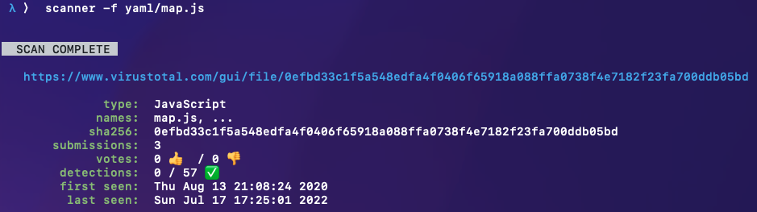
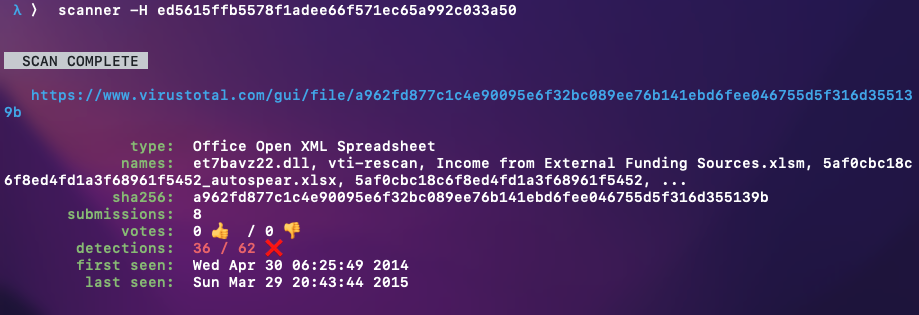
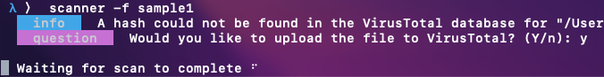

# Scanner

Scanner, or cli-scanner, is a command-line program to analyze files directly from your terminal using the VirusTotal API, displaying relative information such as thread detections, recent spottings, and associated file names.

## Demo 

Scanning a file by file name:



Scanning a file by hash: 


As an added privacy feature, if the file does not exist in the VirusTotal database, you will be notified prior to upload:



## Quick Setup

Building Scanner is easy, and requires only 3 steps:

1. Clone the repository:

```
$ git clone https://github.com/spacetimed/cli-scanner
```

2. Create a new file called `scanner/secret.py`, and add your VirusTotal API key as a variable named `API_KEY`. You must create a VirusTotal account to create an API key.

```
$ touch cli-scanner/scanner/secret.py

$ echo "API_KEY='644bc...afcd'" > cli-scanner/scanner/secret.py

$ cat cli-scanner/scanner/secret.py
API_KEY='644bc...afcd'

```

3. Build your Python module:

```
$ pip install .
```

Scanner is now ready to be used with the `scanner` command in your command line.


## Usage

Type the following command in your terminal to view the basic usage of scanner:

```
$ scanner --help
usage: scanner [-h] (-f FILE | -H HASH)

optional arguments:
  -h, --help            show this help message and exit
  -f FILE, --file FILE  relative file name
  -H HASH, --hash HASH  hash
```

As shown above, scanner requires one of two arguments:

1. `-f` or `--file` : Scan a file by relative path name.
    * If the file has not been previously scanned in the VirusTotal database, it will be optionally uploaded at the user's discretion.
2. `-H` or `--hash` : Scan a hash (sha256 or md5).
    * If the hash has not been previously scanned in the VirusTotal database, cli-scanner will be unable to fetch scan information.
